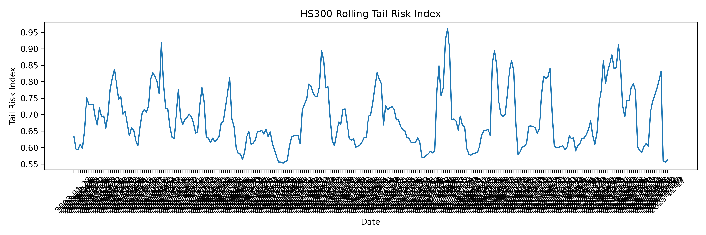
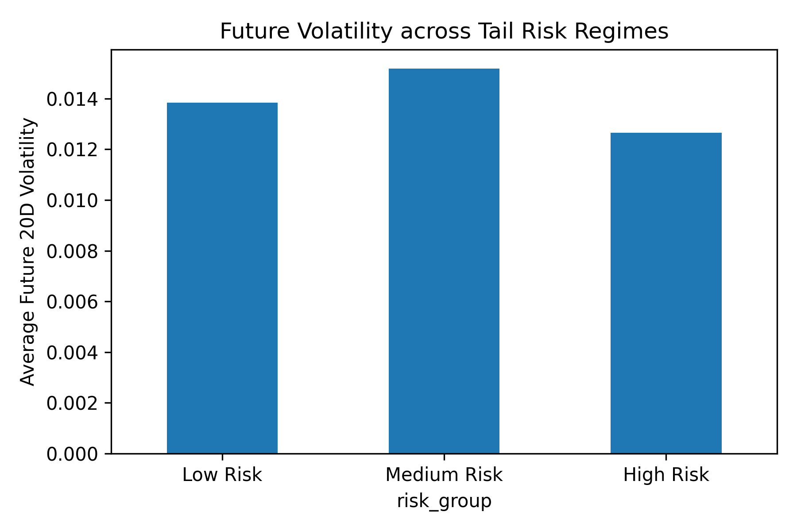

# HS300 Stochastic Risk Engine

## Overview

This project develops a stochastic financial risk engine for monitoring market stress and identifying abnormal market states.

The framework models the financial market as a stochastic dynamical system and combines:

- Market state representation
- Harris ergodic dynamics analysis
- Ruelle–Perron–Frobenius (RPF) spectral analysis
- DV-inspired large deviation risk estimation
- Market regime detection
- Rolling risk monitoring

Unlike traditional return prediction models, this project focuses on understanding the evolution of market instability and constructing dynamic indicators for tail risk conditions.

---

# Research Motivation

Financial markets exhibit complex nonlinear dynamics, regime transitions, and extreme fluctuations.

Traditional volatility indicators often describe historical variability but may not fully capture changes in market stability and abnormal state transitions.

This project introduces a stochastic dynamics perspective:

```
Market observations

        ↓

State representation

        ↓

Dynamical stability analysis

        ↓

Deviation from normal market behavior

        ↓

Tail risk indicator
```

The objective is to quantify evolving market stress through stochastic state evolution.

---

# Framework

```
HS300 Market Data

        ↓

Market State Embedding

        ↓

Harris Ergodic Analysis

        ↓

Shock Recovery Estimation

        ↓

RPF Spectral Stability Analysis

        ↓

Large Deviation Risk Estimation

        ↓

Tail Risk Index Construction

        ↓

Market Regime Detection

        ↓

Rolling Risk Monitoring
```

---

# Methodology

## 1. Market State Embedding

Historical HS300 index returns are transformed into local market state vectors.

The state representation captures short-term market dynamics and provides a stochastic description of evolving market conditions.

Input:

```
Historical HS300 returns
```

Output:

```
Market state vectors
```

These states are used for subsequent dynamical analysis.

---

# 2. Harris Ergodic Dynamics

The framework analyzes market relaxation properties using Harris ergodic theory.

The mixing rate characterizes how quickly the market state loses memory after disturbances.

The shock recovery half-life is calculated as:

\[
T_{1/2}=\frac{\ln(2)}{\lambda}
\]

where:

- \( \lambda \) represents the estimated mixing rate.
- \(T_{1/2}\) represents the characteristic recovery time after market shocks.

A longer half-life indicates slower recovery and potentially higher market instability.

---

# 3. Ruelle–Perron–Frobenius Spectral Analysis

The transition stability of market states is investigated using spectral analysis.

The spectral gap is used as a measure of market regime stability.

A changing spectral structure reflects variations in:

- state persistence
- transition dynamics
- market stability

---

# 4. Large Deviation Risk Estimation

A DV-inspired large deviation estimator is introduced to quantify deviations from normal market dynamics.

The estimator measures the intensity of abnormal market states and provides a quantitative stress indicator.

Higher deviation intensity represents stronger departure from typical market behavior.

---

# 5. Rolling Risk Engine

A rolling analysis framework is developed to generate time-varying risk indicators.

For each rolling window, the engine calculates:

```
Date

Mixing Rate

Shock Half-life

Spectral Gap

DV Risk Rate

Tail Risk Index

Market Regime
```

The rolling output provides a dynamic representation of market stress evolution.

---

# Results

## Rolling Tail Risk Evolution




The tail risk index exhibits dynamic fluctuations over time, reflecting changes in market stress conditions.

The indicator provides a continuous measurement of deviations from normal market dynamics.

---

## Risk Regime Analysis




Market states are categorized into different risk regimes according to the tail risk indicator.

The analysis provides an exploratory view of the relationship between identified stress conditions and subsequent market uncertainty.

---

# Example Output

```
======================================
   HS300 STOCHASTIC RISK ENGINE
======================================

Market Dataset:
HS300 Index

Samples:
5821

State Dimension:
(5811, 7)


Mixing Rate (Harris):
0.010455


Shock Half-life:
66.28 days


Spectral Gap (RPF):
0.439765


DV Tail Risk Rate:
0.999997


Tail Risk Index:
0.694556


Market Regime:
stable regime

======================================
```

---

# Project Structure

```
stochastic-risk-engine/

│
├── data/
│   ├── HS300.csv
│   └── hs300_loader.py
│
├── features/
│   └── state_embedding.py
│
├── core_math/
│   ├── harris_ergodicity.py
│   ├── rpf_operator.py
│   └── dv_ldp_solver.py
│
├── market_dynamics/
│   └── regime_detector.py
│
├── quant_signals/
│   ├── tail_risk_index.py
│   └── half_life.py
│
├── analysis/
│   └── rolling_engine.py
│
├── main.py
│
├── HS300_risk_series.csv
│
├── tail_risk_curve.png
│
└── risk_regime_validation.png

```

---

# Key Features

- Stochastic market state modeling
- Market stability analysis based on ergodic dynamics
- Spectral characterization of regime transitions
- Large deviation inspired tail risk measurement
- Rolling financial stress monitoring

---

# Technology Stack

- Python
- NumPy
- Pandas
- Matplotlib


---

# Future Extensions

Possible future improvements:

- Multi-market validation
- More expressive nonlinear state embeddings
- Adaptive regime classification
- Extreme event probability modeling
- Real-time financial stress monitoring


---

# Author

**刘珂 (Ke Liu)**  

PhD Candidate in Mathematics, National University of Defense Technology (NUDT)  

Email: 15030368689@163.com  

GitHub: https://github.com/liuke-research/stochastic-risk-engine
